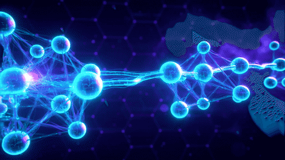

# Hi there, I'm Siddhant Uke 👋

**AI/ML Engineer** — I build production GenAI systems: RAG pipelines, structured-output LLM workflows, and agentic AI with evals, guardrails, and real deployments.

🌐 **Portfolio:** [siddhantuke.github.io](https://siddhantuke.github.io)
📫 **Reach me:** [ukesidd@gmail.com](mailto:ukesidd@gmail.com) · [LinkedIn](https://www.linkedin.com/in/siddhant-uke)

---

### 🛠️ Tech Stack

---

### 📊 GitHub Stats

---

### 🚀 Featured Work

| Project | What it does | Result |
|---|---|---|
| [Production RAG Chatbot](https://siddhantuke.github.io#projects) | Hybrid retrieval (pgvector) + cross-encoder rerank + eval pipeline | **87% P@5**, −30% resolution time |
| [Structured-Output LLM Pipeline](https://siddhantuke.github.io#projects) | GPT-4.1 function calling → Pydantic-validated outputs → internal REST APIs | **88% accuracy**, −45% manual triage |
| [Corrective RAG](https://siddhantuke.github.io#projects) | LangGraph retrieve → grade → rewrite → web-fallback loop | **−25% hallucinations** |
| [Agentic Workflows](https://siddhantuke.github.io#projects) | Planner → router → executor → verifier, human-in-the-loop | **−40%** manual intervention |
| [Vision Diet App](https://siddhantuke.github.io#projects) | Gemini Vision + Streamlit nutrition tracking | Shipped side project |

Full case studies with architecture diagrams on my [portfolio](https://siddhantuke.github.io).

---

### 🎯 Currently

- 🔭 Deepening **multi-agent orchestration** (CrewAI, AutoGen) and **backend API craft**
- 🌱 Learning how real AI apps are **engineered & deployed**, not just demoed
- 💬 Ask me about **RAG, LLM evals, LangGraph, production GenAI**

